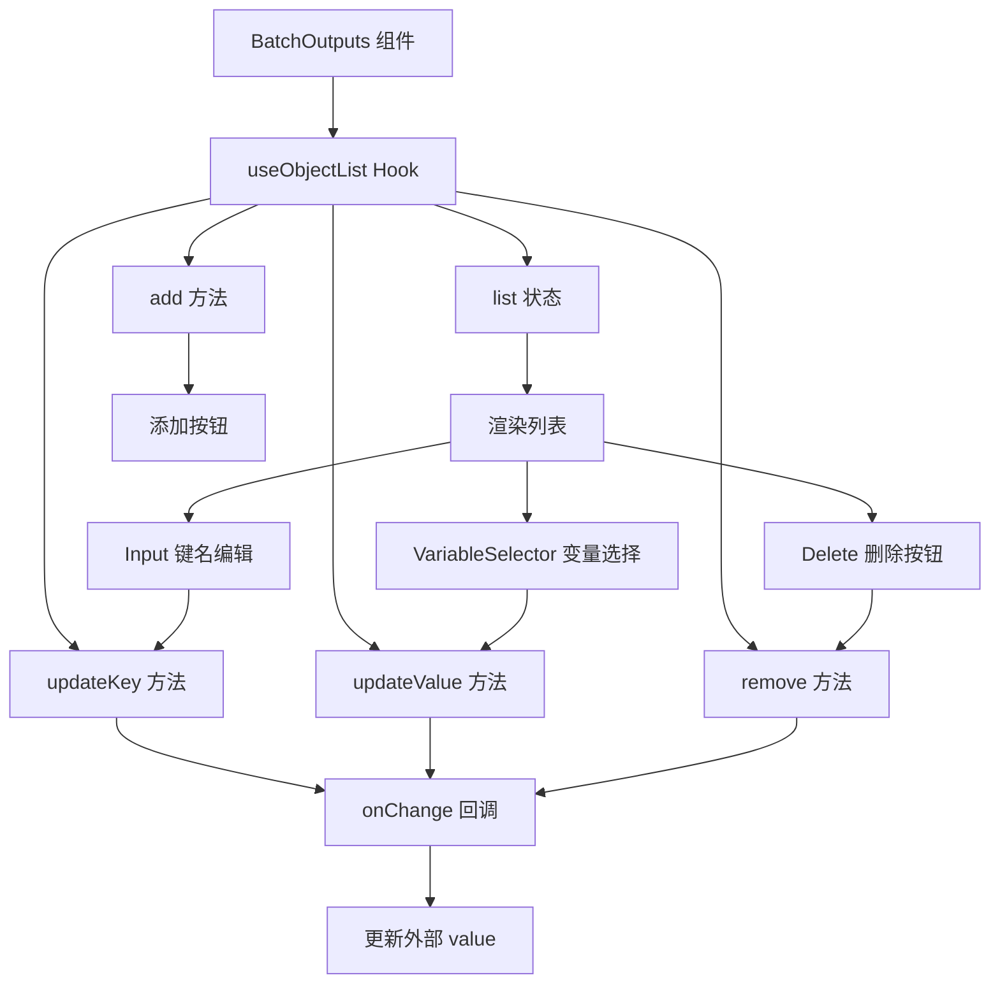
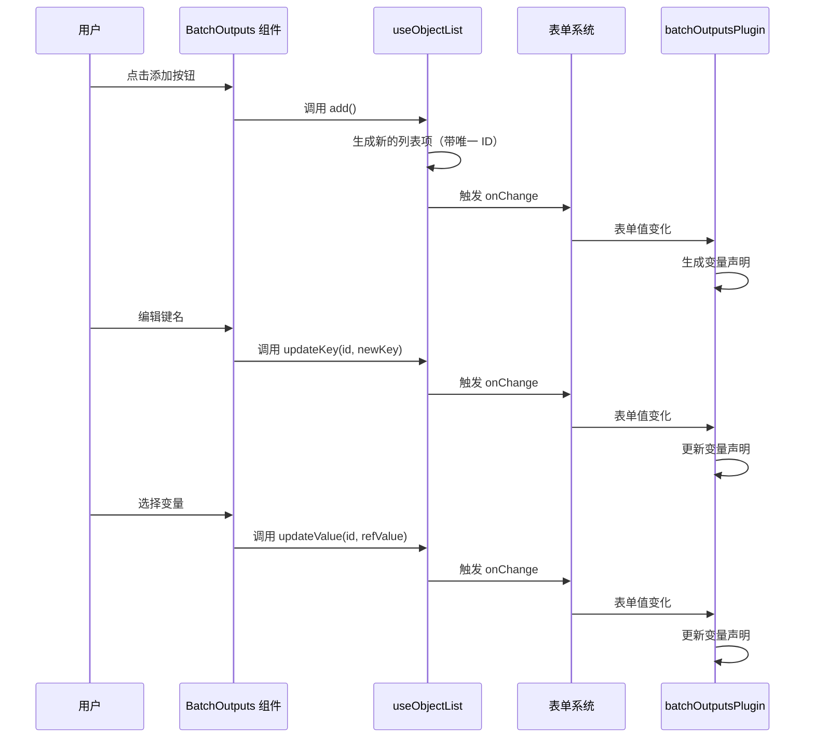

import { SourceCode } from '@theme';
import { BasicStory } from 'components/form-materials/components/batch-outputs';

# BatchOutputs

`BatchOutputs` 是一个用于配置循环输出的键值对编辑器组件。在循环节点场景中，它允许用户定义每次迭代需要收集的输出值，这些值最终会被聚合成数组。

**核心特性：**

- ➕ **动态添加/删除**：用户可以自由添加或删除输出键值对
- ✏️ **键名编辑**：为每个输出定义一个唯一的键名
- 🔗 **变量引用**：通过变量选择器引用循环体内可用的变量
- 👁️ **只读模式**：支持只读展示，适用于查看场景

:::warning

`BatchOutputs` 必须搭配 [batchOutputsPlugin](../form-plugins/batch-outputs-plugin) 使用才能正常工作。这是因为：
1. 组件负责 UI 交互，收集用户配置的输出键值对
2. 插件负责将配置转换为变量声明，并调整作用域链

:::

:::info{title="完整方案概览"}

实现一个完整的循环节点需要以下三个物料配合使用：

| 物料 | 类型 | 职责 |
|------|------|------|
| [BatchVariableSelector](./batch-variable-selector) | 组件 | 选择循环的数组数据源 |
| [provideBatchInputEffect](../effects/provide-batch-input) | 副作用 | 生成 `item` 和 `index` 局部变量 |
| **BatchOutputs** + [batchOutputsPlugin](../form-plugins/batch-outputs-plugin) | 组件 + 插件 | 配置循环输出并生成数组类型变量 |

:::

## 案例演示

### 基本使用

<BasicStory />

```tsx pure title="form-meta.tsx"
import { FormRenderProps, FlowNodeJSON, Field, FormMeta } from '@flowgram.ai/free-layout-editor';
import {
  BatchOutputs,
  BatchVariableSelector,
  createBatchOutputsFormPlugin,
  IFlowRefValue,
  provideBatchInputEffect,
} from '@flowgram.ai/form-materials';

interface LoopNodeJSON extends FlowNodeJSON {
  data: {
    loopFor: IFlowRefValue;
  };
}

export const LoopFormRender = ({ form }: FormRenderProps<LoopNodeJSON>) => {
  return (
    <>
      <FormHeader />
      <FormContent>
        <Field<IFlowRefValue> name="loopFor">
          {({ field, fieldState }) => (
            <FormItem name="loopFor" type="array" required>
              <BatchVariableSelector
                style={{ width: '100%' }}
                value={field.value?.content}
                onChange={(val) => field.onChange({ type: 'ref', content: val })}
                hasError={Object.keys(fieldState?.errors || {}).length > 0}
              />
            </FormItem>
          )}
        </Field>
        <Field<Record<string, IFlowRefValue | undefined> | undefined> name="loopOutputs">
          {({ field, fieldState }) => (
            <FormItem name="loopOutputs" type="object" vertical>
              <BatchOutputs
                style={{ width: '100%' }}
                value={field.value}
                onChange={(val) => field.onChange(val)}
                hasError={Object.keys(fieldState?.errors || {}).length > 0}
              />
            </FormItem>
          )}
        </Field>
      </FormContent>
    </>
  );
};

export const formMeta: FormMeta = {
  render: LoopFormRender,
  effect: {
    loopFor: provideBatchInputEffect,
  },
  plugins: [createBatchOutputsFormPlugin({ outputKey: 'loopOutputs', inferTargetKey: 'outputs' })],
};
```

:::info{title="关于 FormHeader、FormContent、FormItem"}

上述代码中的 `FormHeader`、`FormContent`、`FormItem` 是用户自定义的布局组件，用于统一表单样式。你可以根据项目需求自行实现或替换为其他 UI 组件。

:::

### 只读模式

通过设置 `readonly` 属性可以禁用编辑功能，适用于查看或预览场景：

```tsx pure
<BatchOutputs
  readonly
  value={{
    names: { type: 'ref', content: ['item', 'name'] },
    ages: { type: 'ref', content: ['item', 'age'] },
  }}
/>
```

## API 参考

### BatchOutputs Props

| 属性名 | 类型 | 默认值 | 描述 |
|--------|------|--------|------|
| `value` | `Record<string, IFlowRefValue \| undefined>` | - | 输出键值对对象，键为输出名称，值为变量引用 |
| `onChange` | `(value?: Record<string, IFlowRefValue \| undefined>) => void` | - | 值变化时的回调函数 |
| `readonly` | `boolean` | `false` | 是否为只读模式 |
| `hasError` | `boolean` | `false` | 是否显示错误状态 |
| `style` | `React.CSSProperties` | - | 自定义样式 |

### 值类型说明

```typescript
type ValueType = Record<string, IFlowRefValue | undefined>;

interface IFlowRefValue {
  type: 'ref';
  content?: string[];
}
```

#### 值结构示例

```typescript
{
  names: { type: 'ref', content: ['loop_1_locals', 'item', 'name'] },
  ages: { type: 'ref', content: ['loop_1_locals', 'item', 'age'] },
  scores: { type: 'ref', content: ['loop_1_locals', 'item', 'score'] },
}
```

## 源码导读

<SourceCode
  href="https://github.com/bytedance/flowgram.ai/tree/main/packages/materials/form-materials/src/components/batch-outputs"
/>

使用 CLI 命令可以复制源代码到本地：

```bash
npx @flowgram.ai/cli@latest materials components/batch-outputs
```

### 目录结构讲解

```
batch-outputs/
├── index.tsx          # 主组件实现
├── types.ts           # 类型定义
└── styles.css         # 样式文件
```

### 核心实现说明

#### 组件结构

BatchOutputs 组件基于 `useObjectList` hook 实现动态列表管理，每一行包含：
- **Input**：用于编辑输出键名
- **InjectVariableSelector**：用于选择变量引用
- **Delete Button**：删除当前行

#### 数据流向



#### useObjectList Hook

`useObjectList` 是一个通用的动态对象列表管理 hook，核心功能：

1. **列表状态管理**：维护带有唯一 ID 的列表项
2. **双向同步**：在 `value` 属性变化时同步更新列表
3. **增删改操作**：提供 `add`、`remove`、`updateKey`、`updateValue` 方法

```typescript
interface UseObjectListOptions<T> {
  value?: Record<string, T | undefined>;
  onChange?: (value?: Record<string, T | undefined>) => void;
}

interface UseObjectListReturn<T> {
  list: Array<{ id: string; key: string; value: T | undefined }>;
  add: () => void;
  remove: (id: string) => void;
  updateKey: (id: string, newKey: string) => void;
  updateValue: (id: string, newValue: T) => void;
}

const { list, add, updateKey, updateValue, remove } = useObjectList({
  value,
  onChange,
});
```

#### 完整数据流时序图



### 依赖梳理

#### flowgram API

[**@flowgram.ai/editor**](https://github.com/bytedance/flowgram.ai/tree/main/packages/client/editor)
- [`I18n`](https://flowgram.ai/auto-docs/editor/modules/I18n): 国际化工具，用于按钮文案

#### 依赖的其他物料

[**useObjectList**](https://github.com/bytedance/flowgram.ai/tree/main/packages/materials/form-materials/src/hooks/use-object-list)
- 动态对象列表管理 hook，处理列表的增删改操作

[**InjectVariableSelector**](./variable-selector)
- 注入式变量选择器，用于选择变量引用

#### 第三方依赖

- `@douyinfe/semi-ui`: UI 组件库，使用 Button、Input 组件
- `@douyinfe/semi-icons`: 图标库，使用 IconDelete、IconPlus 图标

## 常见问题

### 为什么需要同时使用 BatchOutputs 组件和 batchOutputsPlugin？

这是关注点分离的设计：

| 角色 | 职责 |
|------|------|
| `BatchOutputs` 组件 | 提供 UI 交互，让用户配置输出键名和变量引用 |
| `batchOutputsPlugin` | 处理数据逻辑，将配置转换为变量声明并调整作用域链 |

单独使用组件只能收集数据，无法生成有效的输出变量；单独使用插件则没有 UI 来配置数据。

### BatchOutputs 与 InputsValues 的区别？

| 特性 | BatchOutputs | InputsValues |
|------|--------------|--------------|
| 用途 | 循环输出配置 | 节点输入配置 |
| 值类型 | `Record<string, IFlowRefValue>` | `IInputsValues` |
| 变量引用 | 只支持变量引用 | 支持常量和变量引用 |
| 适用场景 | Loop 节点的输出聚合 | 通用节点的输入参数 |

### 如何自定义变量选择器的过滤条件？

目前 `BatchOutputs` 内部使用 `InjectVariableSelector`，不支持自定义过滤条件。如果需要自定义，可以参考源码实现自己的组件：

```tsx
import { useObjectList } from '@flowgram.ai/form-materials';
import { VariableSelector } from '@flowgram.ai/form-materials';

function CustomBatchOutputs(props) {
  const { list, add, updateKey, updateValue, remove } = useObjectList(props);
  
  return (
    <div>
      {list.map((item) => (
        <div key={item.id}>
          <Input value={item.key} onChange={(v) => updateKey(item.id, v)} />
          <VariableSelector
            value={item.value?.content}
            onChange={(v) => updateValue(item.id, { type: 'ref', content: v })}
            includeSchema={{ type: 'string' }}
          />
          <Button onClick={() => remove(item.id)}>删除</Button>
        </div>
      ))}
      <Button onClick={() => add()}>添加</Button>
    </div>
  );
}
```

### 如何获取生成的输出变量类型？

配合 `batchOutputsPlugin` 使用时，如果配置了 `inferTargetKey`，输出变量的 JSON Schema 会在表单提交时自动写入指定字段：

```typescript
plugins: [
  createBatchOutputsFormPlugin({ 
    outputKey: 'loopOutputs', 
    inferTargetKey: 'outputs'
  })
]
```

提交后的表单数据结构示例：

```typescript
{
  loopOutputs: {
    names: { type: 'ref', content: ['item', 'name'] },
    ages: { type: 'ref', content: ['item', 'age'] },
  },
  outputs: {
    type: 'object',
    properties: {
      names: { type: 'array', items: { type: 'string' } },
      ages: { type: 'array', items: { type: 'number' } },
    }
  }
}
```

### 如何处理键名重复的情况？

目前组件不会自动检测键名重复。建议在表单层面添加校验逻辑：

```typescript
const formMeta: FormMeta = {
  validate: {
    loopOutputs: (value) => {
      if (!value) return;
      const keys = Object.keys(value);
      const uniqueKeys = new Set(keys);
      if (keys.length !== uniqueKeys.size) {
        return '输出键名不能重复';
      }
    },
  },
};
```

## 相关物料

- [BatchVariableSelector](./batch-variable-selector): 数组变量选择器，用于选择循环输入
- [provideBatchInputEffect](../effects/provide-batch-input): 循环输入变量解析副作用
- [batchOutputsPlugin](../form-plugins/batch-outputs-plugin): 循环输出插件，处理作用域链和类型推导
