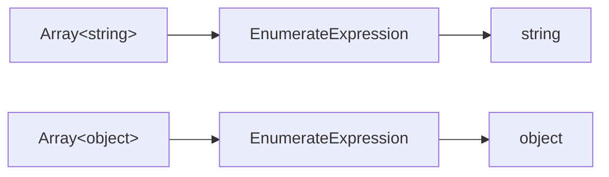
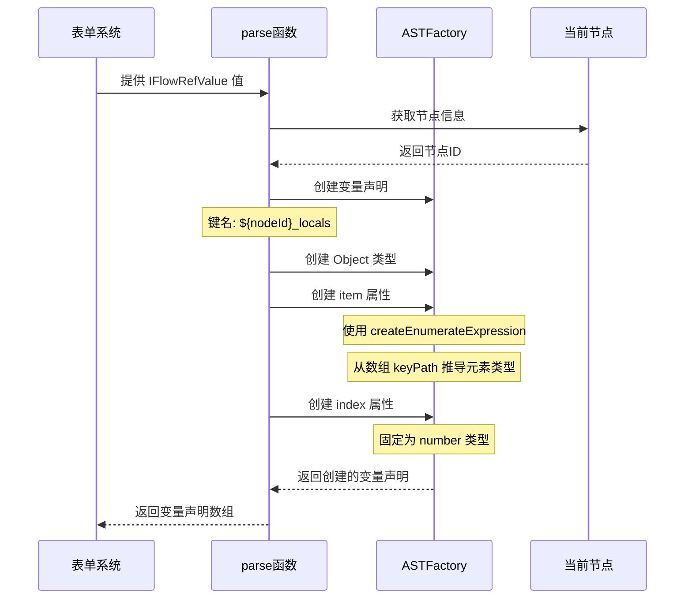
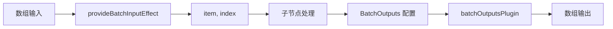

import { SourceCode } from '@theme';
import { BasicStory } from 'components/form-materials/effects/provide-batch-input';

# provideBatchInputEffect

`provideBatchInputEffect` 是一个表单副作用，专门用于循环节点场景。它能够将循环输入的数组变量解析为两个局部变量：

- **item**：当前迭代的数组元素，类型会根据输入数组的元素类型自动推导
- **index**：当前迭代的索引，类型为 number

**核心特性：**

- 🔄 **自动类型推导**：从数组类型自动推导出 `item` 的元素类型
- 🔒 **私有作用域**：生成的变量存储在节点私有作用域，仅当前节点及子节点可访问
- 🎯 **循环专用**：专为批处理/循环场景设计

这使得循环体内的子节点可以引用 `item` 和 `index` 变量，实现对数组元素的逐个处理。

:::info{title="完整方案概览"}

实现一个完整的循环节点需要以下三个物料配合使用：

| 物料 | 类型 | 职责 |
|------|------|------|
| [BatchVariableSelector](../components/batch-variable-selector) | 组件 | 选择循环的数组数据源 |
| **provideBatchInputEffect** | 副作用 | 生成 `item` 和 `index` 局部变量 |
| [BatchOutputs](../components/batch-outputs) + [batchOutputsPlugin](../form-plugins/batch-outputs-plugin) | 组件 + 插件 | 配置循环输出并生成数组类型变量 |

:::

## 案例演示

### 基本使用

:::tip

选择一个数组类型的变量后，`provideBatchInputEffect` 会自动生成 `item` 和 `index` 局部变量，可以在下方的变量选择器中看到这些变量。

:::

<BasicStory />

```tsx pure title="form-meta.tsx"
import { FormRenderProps, FlowNodeJSON, Field, FormMeta } from '@flowgram.ai/free-layout-editor';
import {
  BatchOutputs,
  BatchVariableSelector,
  createBatchOutputsFormPlugin,
  IFlowRefValue,
  provideBatchInputEffect,
} from '@flowgram.ai/form-materials';

interface LoopNodeJSON extends FlowNodeJSON {
  data: {
    loopFor: IFlowRefValue;
  };
}

export const LoopFormRender = ({ form }: FormRenderProps<LoopNodeJSON>) => {
  return (
    <>
      <FormHeader />
      <FormContent>
        <Field<IFlowRefValue> name="loopFor">
          {({ field, fieldState }) => (
            <FormItem name="loopFor" type="array" required>
              <BatchVariableSelector
                style={{ width: '100%' }}
                value={field.value?.content}
                onChange={(val) => field.onChange({ type: 'ref', content: val })}
                hasError={Object.keys(fieldState?.errors || {}).length > 0}
              />
            </FormItem>
          )}
        </Field>
        <Field<Record<string, IFlowRefValue | undefined> | undefined> name="loopOutputs">
          {({ field, fieldState }) => (
            <FormItem name="loopOutputs" type="object" vertical>
              <BatchOutputs
                style={{ width: '100%' }}
                value={field.value}
                onChange={(val) => field.onChange(val)}
                hasError={Object.keys(fieldState?.errors || {}).length > 0}
              />
            </FormItem>
          )}
        </Field>
      </FormContent>
    </>
  );
};

export const formMeta: FormMeta = {
  render: LoopFormRender,
  effect: {
    loopFor: provideBatchInputEffect,
  },
  plugins: [createBatchOutputsFormPlugin({ outputKey: 'loopOutputs', inferTargetKey: 'outputs' })],
};
```

:::info{title="关于 FormHeader、FormContent、FormItem"}

上述代码中的 `FormHeader`、`FormContent`、`FormItem` 是用户自定义的布局组件，用于统一表单样式。你可以根据项目需求自行实现或替换为其他 UI 组件。

:::

## API 参考

### provideBatchInputEffect

提供一个表单副作用，将循环输入的数组变量解析为 `item` 和 `index` 局部变量。

```typescript
import { provideBatchInputEffect } from '@flowgram.ai/form-materials';

const formMeta: FormMeta = {
  effect: {
    loopFor: provideBatchInputEffect,
  },
};
```

#### 参数

该副作用内部使用 `createEffectFromVariableProvider` 创建，配置如下：

| 属性 | 值 | 说明 |
|------|------|------|
| `private` | `true` | 生成的变量存储在节点私有作用域 |

:::tip{title="关于 private 参数"}

设置 `private: true` 后，变量会存储在 `node.privateScope` 而非 `node.scope`。这意味着：
- 变量仅在当前节点及其子节点中可见
- 不会被父节点的下游节点访问
- 适用于循环场景中的临时迭代变量

详见：[节点私有作用域](../../guide/variable/concept#节点私有作用域)

:::

#### 返回值

- `EffectOptions[]`: 表单副作用选项数组，用于 `formMeta.effect` 配置

#### 生成的变量结构

副作用会在当前节点的**私有作用域**下创建一个变量 `${nodeId}_locals`，结构如下：

| 字段 | 类型 | 描述 |
|------|------|------|
| `item` | 根据数组元素类型推导 | 当前迭代的数组元素 |
| `index` | `number` | 当前迭代的索引 |

#### 生成的 AST 结构示例

假设循环输入变量路径为 `['start_0', 'list']`，生成的 AST 结构如下：

```typescript
{
  kind: 'VariableDeclaration',
  key: 'loop_1_locals',
  meta: {
    title: '循环节点',
    icon: 'loop-icon'
  },
  type: {
    kind: 'ObjectType',
    properties: [
      {
        kind: 'Property',
        key: 'item',
        initializer: {
          kind: 'EnumerateExpression',
          enumerateFor: {
            kind: 'KeyPathExpression',
            keyPath: ['start_0', 'list']
          }
        }
      },
      {
        kind: 'Property',
        key: 'index',
        type: { kind: 'NumberType' }
      }
    ]
  }
}
```

## 源码导读

<SourceCode
  href="https://github.com/bytedance/flowgram.ai/tree/main/packages/materials/form-materials/src/effects/provide-batch-input/index.ts"
/>

使用 CLI 命令可以复制源代码到本地：

```bash
npx @flowgram.ai/cli@latest materials effects/provide-batch-input
```

### 目录结构讲解

```
provide-batch-input/
└── index.ts           # 主实现文件，导出 provideBatchInputEffect 表单副作用
```

### 核心实现说明

#### 变量生成逻辑

`provideBatchInputEffect` 使用 [`createEffectFromVariableProvider`](../../guide/variable/variable-output) 工厂函数创建变量提供器。核心特点：

1. **私有变量**：设置 `private: true`，生成的变量仅在当前节点作用域内可见
2. **元素类型推导**：使用 `ASTFactory.createEnumerateExpression` 从数组类型推导出元素类型
3. **索引变量**：固定为 `number` 类型

#### 类型推导原理

`EnumerateExpression` 是变量引擎提供的表达式类型，用于从数组类型推导元素类型：



当上游变量类型变化时，`item` 的类型会**自动联动更新**。

#### 变量生成流程时序图



#### 关键代码解析

```typescript
export const provideBatchInputEffect: EffectOptions[] = createEffectFromVariableProvider({
  private: true,
  parse: (value: IFlowRefValue, ctx) => [
    ASTFactory.createVariableDeclaration({
      key: `${ctx.node.id}_locals`,
      meta: {
        title: ctx.node.form?.getValueIn('title'),
        icon: ctx.node.getNodeRegistry<FlowNodeRegistry>().info?.icon,
      },
      type: ASTFactory.createObject({
        properties: [
          ASTFactory.createProperty({
            key: 'item',
            initializer: ASTFactory.createEnumerateExpression({
              enumerateFor: ASTFactory.createKeyPathExpression({
                keyPath: value.content || [],
              }),
            }),
          }),
          ASTFactory.createProperty({
            key: 'index',
            type: ASTFactory.createNumber(),
          }),
        ],
      }),
    }),
  ],
});
```

### 依赖梳理

#### flowgram API

[**@flowgram.ai/editor**](https://github.com/bytedance/flowgram.ai/tree/main/packages/client/editor)
- [`EffectOptions`](https://flowgram.ai/auto-docs/editor/types/EffectOptions): 表单副作用选项类型
- [`FlowNodeRegistry`](https://flowgram.ai/auto-docs/document/interfaces/FlowNodeRegistry-1): 节点注册类型定义
- [`createEffectFromVariableProvider`](../../guide/variable/variable-output): 从变量提供器创建表单副作用的工厂函数

[**@flowgram.ai/variable-core**](https://github.com/bytedance/flowgram.ai/tree/main/packages/variable-engine/variable-core)
- [`ASTFactory`](https://flowgram.ai/auto-docs/editor/modules/ASTFactory): AST 创建工厂，用于生成变量声明
- `ASTFactory.createEnumerateExpression`: 创建枚举表达式，用于从数组类型推导元素类型
- `ASTFactory.createKeyPathExpression`: 创建键路径表达式，用于引用变量路径

#### 依赖的其他物料

[**BatchVariableSelector**](../components/batch-variable-selector)
- 用于选择数组类型的变量，配合 `provideBatchInputEffect` 使用

## 常见问题

### 为什么 item 的类型能自动推导？

`provideBatchInputEffect` 使用 `ASTFactory.createEnumerateExpression` 创建 `item` 变量。`EnumerateExpression` 是一种特殊的表达式，它会：

1. 接收一个数组类型的变量引用（通过 `KeyPathExpression`）
2. 自动推导出数组的元素类型作为自己的返回类型
3. 当上游数组类型变化时，自动触发类型联动更新

详见：[变量概念 - 表达式](../../guide/variable/concept#表达式)

### 生成的变量为什么在变量选择器中看不到？

检查以下几点：

1. **作用域问题**：`provideBatchInputEffect` 生成的是私有变量（存储在 `node.privateScope`），只有当前节点及其子节点可以访问
2. **配置位置**：确保 `provideBatchInputEffect` 配置在正确的字段路径上
3. **组件配置**：如果使用 `BatchVariableSelector`，它会自动提供 `PrivateScopeProvider`；如果使用普通 `VariableSelector`，需要手动包裹 `PrivateScopeProvider`

### 如何自定义 item 和 index 的变量名？

目前 `provideBatchInputEffect` 不支持自定义变量名。如果需要自定义，可以参考源码实现，使用 `createEffectFromVariableProvider` 创建自己的副作用：

```typescript
import { createEffectFromVariableProvider, ASTFactory } from '@flowgram.ai/editor';

export const customBatchInputEffect = createEffectFromVariableProvider({
  private: true,
  parse: (value, ctx) => [
    ASTFactory.createVariableDeclaration({
      key: `${ctx.node.id}_locals`,
      type: ASTFactory.createObject({
        properties: [
          ASTFactory.createProperty({
            key: 'currentItem',
            initializer: ASTFactory.createEnumerateExpression({
              enumerateFor: ASTFactory.createKeyPathExpression({
                keyPath: value.content || [],
              }),
            }),
          }),
          ASTFactory.createProperty({
            key: 'currentIndex',
            type: ASTFactory.createNumber(),
          }),
        ],
      }),
    }),
  ],
});
```

### 与 batchOutputsPlugin 的关系是什么？

| 物料 | 职责 | 生成的变量 |
|------|------|------|
| `provideBatchInputEffect` | 处理循环**输入** | `item`、`index`（私有变量） |
| `batchOutputsPlugin` | 处理循环**输出** | 用户配置的输出键（公共变量，数组类型） |

两者配合使用，形成完整的循环节点变量逻辑：



## 相关物料

- [BatchVariableSelector](../components/batch-variable-selector): 数组变量选择器，用于选择循环输入
- [BatchOutputs](../components/batch-outputs): 循环输出配置组件
- [batchOutputsPlugin](../form-plugins/batch-outputs-plugin): 循环输出插件，处理作用域链和类型推导
