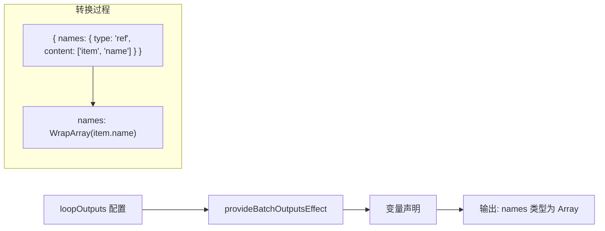
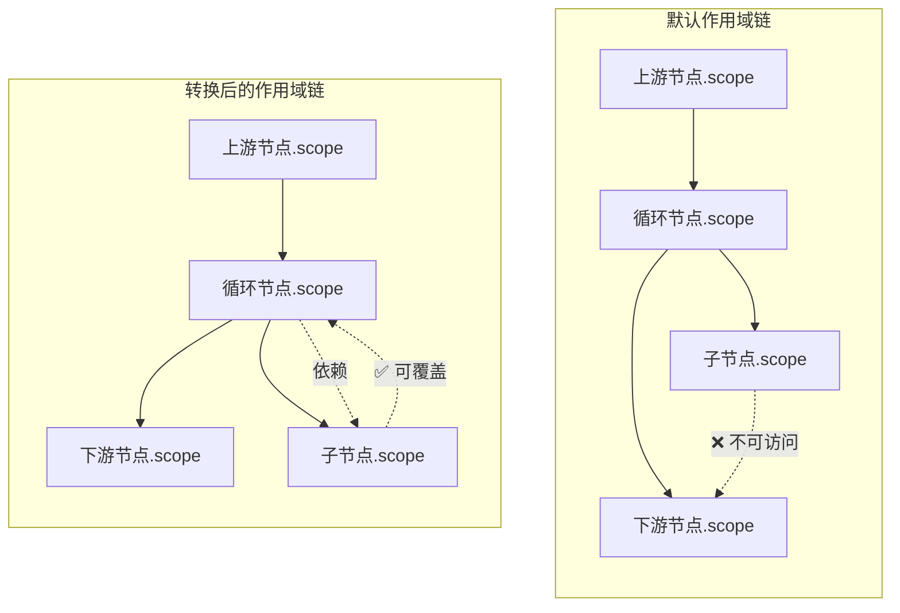

import { SourceCode } from '@theme';
import { BasicStory, WithInferSchemaStory } from 'components/form-materials/form-plugins/batch-outputs-plugin';

# batchOutputsPlugin

`batchOutputsPlugin` 是一个用于循环节点的表单插件，它实现了两个核心功能：

1. **输出变量生成**：将循环体内收集的变量引用转换为数组类型的输出变量
2. **作用域链转换**：调整变量作用域链，使循环节点的输出能正确依赖子节点的输出

**核心特性：**

- 🔄 **数组包装**：自动将循环体内引用的变量包装为数组类型输出
- 🔗 **作用域链调整**：让循环节点的输出变量能正确依赖子节点的输出
- 📊 **Schema 推导**：可选配置，自动推导输出变量的 JSON Schema

:::tip{title="适用场景"}

- **循环节点**：需要在每次迭代中收集数据并聚合成数组
- **批处理节点**：需要将多个子任务的结果汇总输出
- **任何包含子节点的容器节点**：需要从子节点收集输出变量

:::

:::warning

`BatchOutputs` 组件必须搭配 `batchOutputsPlugin` 使用才能正常工作。这是因为：
1. 组件负责 UI 交互，收集用户配置的输出键值对
2. 插件负责将配置转换为变量声明，并调整作用域链

:::

:::info{title="完整方案概览"}

实现一个完整的循环节点需要以下三个物料配合使用：

| 物料 | 类型 | 职责 |
|------|------|------|
| [BatchVariableSelector](../components/batch-variable-selector) | 组件 | 选择循环的数组数据源 |
| [provideBatchInputEffect](../effects/provide-batch-input) | 副作用 | 生成 `item` 和 `index` 局部变量 |
| [BatchOutputs](../components/batch-outputs) + **batchOutputsPlugin** | 组件 + 插件 | 配置循环输出并生成数组类型变量 |

:::

## 案例演示

### 基本使用

:::tip

点开 demo 右上角的 Debug 面板，查看生成的输出变量和传到后端的 JSON 数据

:::

<BasicStory />

```tsx pure title="form-meta.tsx"
import { FormRenderProps, FlowNodeJSON, Field, FormMeta } from '@flowgram.ai/free-layout-editor';
import {
  BatchOutputs,
  BatchVariableSelector,
  createBatchOutputsFormPlugin,
  IFlowRefValue,
  provideBatchInputEffect,
} from '@flowgram.ai/form-materials';

interface LoopNodeJSON extends FlowNodeJSON {
  data: {
    loopFor: IFlowRefValue;
  };
}

export const LoopFormRender = ({ form }: FormRenderProps<LoopNodeJSON>) => {
  return (
    <>
      <FormHeader />
      <FormContent>
        <Field<IFlowRefValue> name="loopFor">
          {({ field, fieldState }) => (
            <FormItem name="loopFor" type="array" required>
              <BatchVariableSelector
                style={{ width: '100%' }}
                value={field.value?.content}
                onChange={(val) => field.onChange({ type: 'ref', content: val })}
                hasError={Object.keys(fieldState?.errors || {}).length > 0}
              />
            </FormItem>
          )}
        </Field>
        <Field<Record<string, IFlowRefValue | undefined> | undefined> name="loopOutputs">
          {({ field, fieldState }) => (
            <FormItem name="loopOutputs" type="object" vertical>
              <BatchOutputs
                style={{ width: '100%' }}
                value={field.value}
                onChange={(val) => field.onChange(val)}
                hasError={Object.keys(fieldState?.errors || {}).length > 0}
              />
            </FormItem>
          )}
        </Field>
      </FormContent>
    </>
  );
};

export const formMeta: FormMeta = {
  render: LoopFormRender,
  effect: {
    loopFor: provideBatchInputEffect,
  },
  plugins: [createBatchOutputsFormPlugin({ outputKey: 'loopOutputs', inferTargetKey: 'outputs' })],
};
```

:::info{title="关于 FormHeader、FormContent、FormItem"}

上述代码中的 `FormHeader`、`FormContent`、`FormItem` 是用户自定义的布局组件，用于统一表单样式。你可以根据项目需求自行实现或替换为其他 UI 组件。

:::

### 配合 Schema 推导

<WithInferSchemaStory />

当配置了 `inferTargetKey` 参数时，插件会在表单提交时自动推导输出变量的 JSON Schema，并存储到指定字段。

## API 参考

### createBatchOutputsFormPlugin

创建批处理输出插件的工厂函数。

```typescript
function createBatchOutputsFormPlugin(options: {
  outputKey: string;
  inferTargetKey?: string;
}): FormPlugin;
```

| 属性名 | 类型 | 默认值 | 描述 |
|--------|------|--------|------|
| `outputKey` | `string` | - | 表单中存储循环输出配置的字段路径 |
| `inferTargetKey` | `string` | - | 可选，推导的 JSON Schema 存储位置的字段路径 |

### provideBatchOutputsEffect

输出变量生成副作用，将 `Record<string, IFlowRefValue>` 格式的配置转换为数组类型的变量声明。

```typescript
import { provideBatchOutputsEffect } from '@flowgram.ai/form-materials';

const formMeta: FormMeta = {
  effect: {
    loopOutputs: provideBatchOutputsEffect,
  },
};
```

:::tip

通常情况下，使用 `createBatchOutputsFormPlugin` 即可，它内部已经包含了 `provideBatchOutputsEffect`。只有在需要单独使用变量生成功能而不需要作用域链转换时，才需要直接使用此副作用。

:::

## 源码导读

<SourceCode
  href="https://github.com/bytedance/flowgram.ai/tree/main/packages/materials/form-materials/src/form-plugins/batch-outputs-plugin/index.ts"
/>

使用 CLI 命令可以复制源代码到本地：

```bash
npx @flowgram.ai/cli@latest materials form-plugins/batch-outputs-plugin
```

### 目录结构讲解

```
batch-outputs-plugin/
└── index.ts           # 插件完整实现，包含变量生成和作用域链转换逻辑
```

### 核心实现说明

#### 插件结构

`createBatchOutputsFormPlugin` 使用 `defineFormPluginCreator` 创建，包含两个核心生命周期：

1. **onSetupFormMeta**：配置表单元数据，注册副作用和提交格式化
2. **onInit**：初始化时注册作用域链转换器

#### 输出变量生成

`provideBatchOutputsEffect` 将 `Record<string, IFlowRefValue>` 转换为变量声明：



关键点：使用 `ASTFactory.createWrapArrayExpression` 将单个值类型包装为数组类型。

#### 作用域链转换

这是该插件最核心的功能，解决循环节点的变量作用域问题。

:::info{title="为什么需要作用域链转换？"}

在默认的作用域链逻辑中（参考[作用域链概念](../../guide/variable/concept#作用域链)）：
- 子节点的输出变量**不能**被父节点的下游节点访问
- 循环节点的输出变量**不能**依赖子节点的输出

但在循环场景中，我们需要：
- 循环节点的输出（如聚合的数组）能依赖子节点在每次迭代中产生的值
- 子节点的变量能"覆盖"到父循环节点的作用域

:::

下图展示了作用域链转换的工作原理：



转换器的两个核心方法：

| 方法 | 作用 | 说明 |
|------|------|------|
| `transformCovers` | 扩展覆盖作用域 | 让子节点的变量可以"覆盖"到父循环节点 |
| `transformDeps` | 调整依赖作用域 | 让循环节点的公共作用域依赖其子节点的作用域 |

```mermaid
sequenceDiagram
    participant Loop as 循环节点
    participant Child as 子节点
    participant Transform as ScopeChainTransformService

    Note over Loop,Child: 问题：循环节点输出依赖子节点输出

    Loop->>Transform: 注册转换器

    Note over Transform: transformCovers（覆盖关系）
    Child->>Transform: 子节点查询覆盖作用域
    Transform-->>Child: 返回 [父循环节点作用域]
    Note over Child: 子节点变量可覆盖父循环节点

    Note over Transform: transformDeps（依赖关系）
    Loop->>Transform: 循环节点查询依赖作用域
    Transform-->>Loop: 返回 [私有作用域, ...子节点作用域]
    Note over Loop: 循环节点输出依赖子节点输出
```

#### 关键代码解析

**1. 变量生成逻辑**

```typescript
export const provideBatchOutputsEffect: EffectOptions[] = createEffectFromVariableProvider({
  parse: (value: Record<string, IFlowRefValue>, ctx) => [
    ASTFactory.createVariableDeclaration({
      key: `${ctx.node.id}`,
      type: ASTFactory.createObject({
        properties: Object.entries(value).map(([_key, value]) =>
          ASTFactory.createProperty({
            key: _key,
            initializer: ASTFactory.createWrapArrayExpression({
              wrapFor: ASTFactory.createKeyPathExpression({
                keyPath: value?.content || [],
              }),
            }),
          })
        ),
      }),
    }),
  ],
});
```

**2. 作用域链转换器**

```typescript
chainTransformService.registerTransformer(transformerId, {
  transformCovers: (covers, ctx) => {
    const node = ctx.scope.meta?.node;
    if (node?.parent?.flowNodeType === batchNodeType) {
      return [...covers, getNodeScope(node.parent)];
    }
    return covers;
  },
  transformDeps(scopes, ctx) {
    const scopeMeta = ctx.scope.meta;
    if (scopeMeta?.type === FlowNodeScopeType.private) {
      return scopes;
    }
    const node = scopeMeta?.node;
    if (node?.flowNodeType === batchNodeType) {
      const childBlocks = node.blocks;
      return [
        getNodePrivateScope(node),
        ...childBlocks.map((_childBlock) => getNodeScope(_childBlock)),
      ];
    }
    return scopes;
  },
});
```

**3. Schema 推导（可选）**

```typescript
if (inferTargetKey) {
  addFormatOnSubmit((formData, ctx) => {
    const outputVariable = getNodeScope(ctx.node).output.variables?.[0];
    if (outputVariable?.type) {
      set(formData, inferTargetKey, JsonSchemaUtils.astToSchema(outputVariable?.type));
    }
    return formData;
  });
}
```

### 依赖梳理

#### flowgram API

[**@flowgram.ai/editor**](https://github.com/bytedance/flowgram.ai/tree/main/packages/client/editor)
- `defineFormPluginCreator`: 定义表单插件的工厂函数
- `EffectOptions`: 表单副作用选项类型
- `createEffectFromVariableProvider`: 从变量提供器创建表单副作用
- `FlowNodeRegistry`: 节点注册类型定义
- `FlowNodeScopeType`: 节点作用域类型枚举
- `getNodeScope`: 获取节点的公共作用域
- `getNodePrivateScope`: 获取节点的私有作用域
- `ScopeChainTransformService`: 作用域链转换服务

[**@flowgram.ai/variable-core**](https://github.com/bytedance/flowgram.ai/tree/main/packages/variable-engine/variable-core)
- `ASTFactory`: AST 创建工厂
- `ASTFactory.createWrapArrayExpression`: 创建数组包装表达式

[**@flowgram.ai/json-schema**](https://github.com/bytedance/flowgram.ai/tree/main/packages/variable-engine/json-schema)
- `JsonSchemaUtils.astToSchema`: 将 AST 转换为 JSON Schema

#### 依赖的其他物料

[**BatchOutputs**](../components/batch-outputs)
- 循环输出配置组件，用于收集输出键值对

[**BatchVariableSelector**](../components/batch-variable-selector)
- 数组变量选择器，用于选择循环输入

[**provideBatchInputEffect**](../effects/provide-batch-input)
- 循环输入副作用，生成 item 和 index 局部变量

## 常见问题

### 为什么需要同时使用 BatchOutputs 组件和 batchOutputsPlugin？

这是关注点分离的设计：

| 角色 | 职责 |
|------|------|
| `BatchOutputs` 组件 | 提供 UI 交互，让用户配置输出键名和变量引用 |
| `batchOutputsPlugin` | 处理数据逻辑，将配置转换为变量声明并调整作用域链 |

单独使用组件只能收集数据，无法生成有效的输出变量；单独使用插件则没有 UI 来配置数据。

### 什么时候需要配置 inferTargetKey？

当你需要将输出变量的类型信息持久化到表单数据中时（例如后端需要知道输出的 JSON Schema），配置 `inferTargetKey` 可以在表单提交时自动推导并存储 Schema。

### 如何与 provideBatchInputEffect 配合使用？

完整的循环节点通常这样配置：

```typescript
export const formMeta: FormMeta = {
  render: LoopFormRender,
  effect: {
    loopFor: provideBatchInputEffect,
  },
  plugins: [
    createBatchOutputsFormPlugin({
      outputKey: 'loopOutputs',
      inferTargetKey: 'outputs'
    })
  ],
};
```

- `provideBatchInputEffect` 负责从循环输入数组生成 `item` 和 `index` 局部变量
- `batchOutputsPlugin` 负责将循环体内收集的变量聚合为数组输出

### 作用域链转换会影响其他节点吗？

不会。转换器通过 `batchNodeType` 精确匹配当前节点类型，只对该类型的节点生效。转换器 ID 也包含节点类型，避免重复注册。

## 相关物料

- [provideBatchInputEffect](../effects/provide-batch-input): 循环输入变量解析
- [BatchOutputs](../components/batch-outputs): 循环输出配置组件
- [BatchVariableSelector](../components/batch-variable-selector): 数组变量选择器
- [inferInputsPlugin](./infer-inputs-plugin): 输入参数 Schema 推导插件
